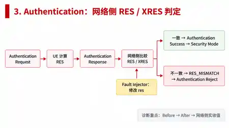
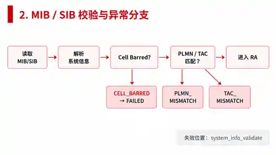

# 状态机与故障诊断

## v6.1.2：失败证据选择与短超时稳定性

失败事务的 `network_decision` 现在只从 `REJECT/DROP` 判定中选择，不再在没有失败 Decision 时退回前序 `ACCEPT`。如果显式 `NETWORK_*_DECISION` 镜像缺失，但实际 `SOCKET_RX.actual.networkDecision` 中携带同一 REJECT/DROP，Diagnosis 会从该接收事实恢复结构化判定。报告新增 `diagnosisSelection`，记录 decisive event/correlation、Timer/Socket/Validation 是否触发、Decision 来源和最终选中的 reject cause，便于专项测试直接核对“诊断到底选了哪条事件”。

测试层同时区分“协议策略失败”和“专门超时实验”：普通参数错误/网络 Reject 使用较充足的工程 guard，只有 `RRC_RESPONSE_TIMEOUT`、`AUTH_RESPONSE_TIMEOUT` 等专门验证等待路径的用例保持短 timeout。这样避免 Windows 负载抖动导致测试计时器先于应出现的同步 REJECT 证据触发；生产故障机制和正常 Timer 语义没有因此放宽。


## v6.1.1：NAS Security 运行证据

Security Mode 包含算法协商和 NAS 报文保护。Authentication 成功后，UE/MME 为当前 transaction 建立 NAS Security Context；Security Mode Command 使用 EIA2 integrity，Security Mode Complete、Attach Accept、Attach Complete 使用 EEA2 + EIA2，并维护独立 UL/DL 32-bit NAS COUNT。

运行事件新增 `NAS_SECURITY_PDU_PROTECTED`、`NAS_SECURITY_PDU_VERIFIED`、`NAS_SECURITY_PDU_FAILED`。Diagnosis/Trace 可以看到 direction、COUNT、sequence、ciphered、MAC 和 PDU SHA-256，但不会拿到 K_NASenc/K_NASint 原始字节。完整性、重放或消息类型检查失败时不提交 RX COUNT，可结合事件记录检查状态变化。

这条证据链与网络侧 Context→Rule→Decision→State→Message 共同使用，仍遵循 Diagnosis 不直接读取 Scenario/FaultConfig 的边界。


## v6.0.4：诊断输入分层与证据不足

v6.0.4 把诊断输入明确分成三层：运行观测事实（Primitive/Socket/Timer/State）、运行中的故障注入证据 `FAULT_INJECTED`、以及网络侧 Context/Decision 事实。普通诊断采用 `STANDARD_RUNTIME_WITH_INJECTION_EVIDENCE`，不读取 Scenario Name 或 FaultConfig，但允许把已经写入 Runtime Event 的注入记录作为证据；“证据隔离复算”采用 `BLIND_RUNTIME_FACTS_ONLY`，过滤 `FAULT_INJECTED` 后再计算。

报告中的 `diagnosisInput.inputLayers` 会给出各层事件数量，`usesScenario=false`、`usesFaultConfig=false` 明确输入边界。若隔离后只剩“某个 Primitive 被创建”之类无法支持根因的事实，系统不再强行给出泛化 Root Cause，而返回 `INSUFFICIENT_EVIDENCE`，`diagnosticVerdict=null`。Runtime Event 在分析前按时间稳定排序，避免 LAN 分页导入或合成测试中的事件顺序差异改变同一证据集的结论。

## v6.0.3：Evidence-only Blind Diagnosis


普通 Diagnosis 分析运行事件，也会使用 `FAULT_INJECTED` 中的字段。点击“证据隔离复算”后，后端排除 `FAULT_INJECTED`，保留 Primitive、Socket、Timer、State Transition、Network Decision 和 Validation/Worker Error。盲诊断报告会明确显示 `scenarioProvided=false`、`faultConfigProvided=false`、`faultInjectedEventsExcluded=true`。



在鉴权异常中，MME Context 保存 XRES，Peer RX 收到实际 RES，Network Decision 执行 `RES == XRES`。因此即使不告诉诊断引擎故障场景，仍可以从 `RES / XRES FAIL → NAS_AUTHENTICATION_REJECT` 推导 `RES_MISMATCH`。




本文列出各阶段消息、异常和计时器，可与 `control_plane/engine.py` 对照阅读。

## 1. 正常 Attach：11 个用户可见步骤

```text
DETACHED
  │
  ├─ 1. 启用无线功能
  │     AT+CFUN=1
  │
  ├─ 2. NAS 发起 Attach
  │     NAS_ATTACH_REQ
  │
  ├─ 3. 读取 MIB/SIB
  │     READ_MIB_SIB → BCCH_DATA_IND
  │
  ├─ 4. 系统信息校验
  │     MIB/SIB present + Cell not barred + PLMN/TAC match
  │
  ├─ 5. 随机接入
  │     RA_PREAMBLE → RA_RESPONSE_IND
  │
  ├─ 6. 建立 RRC 连接
  │     RRC_CONNECTION_REQUEST → RRC_SETUP_IND
  │     └─ 内部子交换：RRC_CONNECTION_SETUP_COMPLETE → RRC_COMPLETE_IND
  │
  ├─ 7. 发送 Attach Request
  │     NAS_ATTACH_REQUEST → AUTH_REQUEST_IND
  │
  ├─ 8. 鉴权
  │     NAS_AUTHENTICATION_RESPONSE → AUTH_RESPONSE_IND
  │
  ├─ 9. NAS 安全模式
  │     NAS_SECURITY_MODE_COMPLETE → SECURITY_RESPONSE_IND
  │
  ├─ 10. 网络接受 Attach
  │      当前简化 Stub 在 Security Mode Complete 的响应中返回 NAS_ATTACH_ACCEPT
  │
  └─ 11. Attach 完成
        NAS_ATTACH_COMPLETE → ATTACH_COMPLETE_IND
        ↓
      ATTACHED
```

### 正常状态推进

| # | Step ID | 页面名称 | 成功判据 | 关键观察对象 |
|---:|---|---|---|---|
| 1 | `cfun_enable` | 启用无线功能 | CFUN=1，创建 Attach transaction | AT / flow state |
| 2 | `nas_attach_req` | NAS 发起 Attach | NAS Worker 接受启动请求 | TaskBus |
| 3 | `mib_sib_read` | 读取 MIB/SIB | 收到 `SYSTEM_INFORMATION` | TCP + `BCCH_DATA_IND` |
| 4 | `system_info_validate` | 系统信息校验 | MIB/SIB 完整，cell/PLMN/TAC 合法 | RRC validation |
| 5 | `random_access` | 随机接入 | `accepted=true` | L2 + `RA_RESPONSE_IND` |
| 6 | `rrc_connection` | 建立 RRC 连接 | Setup + Setup Complete 子交换成功 | RRC/L2/L1 + T300 |
| 7 | `nas_attach_request` | 发送 Attach Request | 网络返回 Authentication Request | NAS + T3410 |
| 8 | `authentication` | 鉴权 | Authentication Response 被接受，获得 Security Mode Command | NAS；MME Stub 侧 T3460 语义 |
| 9 | `security_mode` | NAS 安全模式 | Security Mode Complete 被接受，获得 Attach Accept | NAS；MME Stub 侧 T3460 语义 |
| 10 | `attach_accept` | 网络接受 Attach | `NAS_ATTACH_ACCEPT` 已到达 | T3410 stop；T3450 start（MME Stub 侧） |
| 11 | `attach_complete` | Attach 完成 | Complete ACK，最终 `ATTACHED` | `G_ATTACH_COMPLETE`；T3450 stop |

## 1.1 异常状态总览（画图时优先使用）

下面先按“用户看到在哪一步停下”汇总当前已经真实实现的异常。快捷模板和自定义 FaultConfig 都走同一 FaultInjector；表中的根因来自运行 Evidence，不由场景名称直接决定。

| 用户可见步骤 | 典型异常 | 实际注入/触发点 | 主要 Root Cause | 后续状态 |
|---|---|---|---|---|
| 1 启用无线功能 | AT/启动失败 | 当前不作为 FaultConfig 注入点；由 AT/Engine 错误处理 | AT / ENGINE ERROR | 不进入 Attach |
| 2 NAS 发起 Attach | Task 启动异常 | 当前不作为外部 FaultConfig 注入点；NAS_ATTACH_REQ 为本地启动原语 | TASK / INVALID_STATE（若发生） | 停在第 2 步 |
| 3 读取 MIB/SIB → 4 校验 | Cell Barred / PLMN / TAC / SIB 缺失 | `BCCH_DATA_IND` 参数真实修改 | `PRIMITIVE_PARAMETER_INVALID` / `PRIMITIVE_MALFORMED` | 第 4 步失败 |
| 5 随机接入 | RA 拒绝 / Drop / Delay / Duplicate | `RA_RESPONSE_IND` | 参数异常 / 原语缺失 / Timer / Duplicate | 第 5 步失败 |
| 6 RRC 建链 | RRC Reject / T300 timeout / Setup Complete 异常 | `RRC_SETUP_IND` / `RRC_COMPLETE_IND` | 参数异常 / `TIMER_EXPIRED` / Missing | 第 6 步失败 |
| 7 Attach Request | 响应参数、Drop、Delay、Duplicate、Socket 故障 | `AUTH_REQUEST_IND` 或 `NAS_ATTACH_REQUEST` Socket TX | Primitive / Timer / Socket 根因 | 第 7 步失败 |
| 8 鉴权 | 网络 Reject、内部参数异常、原语丢失、Socket 丢失 | `NAS_AUTHENTICATION_RESPONSE` / `AUTH_RESPONSE_IND` | `NETWORK_REJECT` / `PRIMITIVE_PARAMETER_INVALID` / `PRIMITIVE_MISSING` / `SOCKET_DROP` | 第 8 步失败 |
| 9 NAS 安全模式 | Security Response 参数异常、Drop/Delay/Duplicate/Socket 故障 | `SECURITY_RESPONSE_IND` / `NAS_SECURITY_MODE_COMPLETE` | Primitive / Timer / Socket 根因 | 第 9 步失败 |
| 10 Attach Accept | 当前由第 9 步成功响应中取得 Attach Accept | 无独立注入点 | 第 9 步异常会阻止进入第 10 步 | 不进入/不完成第 10 步 |
| 11 Attach Complete | ACK 参数异常、Drop、Delay、Duplicate、Socket 故障 | `ATTACH_COMPLETE_IND` / `NAS_ATTACH_COMPLETE` | Primitive / Timer / Socket 根因 | 第 11 步失败 |

第 1、2、10 步没有独立 FaultConfig 注入点。可用位置由字段目录定义。

## 2. Fault Injection 的真实执行链

所有预设与自定义故障最终都转换为同一份 `FaultConfig`：

```text
FaultConfig
   ↓
FaultInjector 在指定注入点匹配一次
   ↓
Primitive delivery 或 Socket TX 的真实对象被修改 / 延迟 / 抑制 / 重复
   ↓
目标 Task / TCP 对端实际消费处理后的值
   ↓
Runtime Event + Timer Event
   ↓
状态机自然成功或失败
   ↓
Diagnosis 根据 Evidence 判 Root Cause
```

Diagnosis 不读取 Scenario 名称决定根因。

## 3. 系统信息类异常：通常在第 4 步终止

### 3.1 CELL_BARRED

```text
第 3 步正常收到 SYSTEM_INFORMATION
  ↓
Fault Injector：BCCH_DATA_IND.sib.cellBarred
false → true
  ↓
第 4 步 SYSTEM_INFO_VALIDATE_REQ
  ↓
RRC 实际读取 true
  ↓
PRIMITIVE_PARAMETER_INVALID
  ↓
Attach 在“系统信息校验”失败
```

证据：`primitive=BCCH_DATA_IND`、`field=sib.cellBarred`、`expected=false`、`actual=true`。

### 3.2 PLMN_MISMATCH

`BCCH_DATA_IND.sib.plmn` 被真实修改，RRC 在第 4 步对照当前 eNB PLMN 后失败。

Root Cause：`PRIMITIVE_PARAMETER_INVALID`。

### 3.3 TAC_MISMATCH

`BCCH_DATA_IND.sib.trackingAreaCode` 被真实修改，第 4 步失败。

Root Cause：`PRIMITIVE_PARAMETER_INVALID`。

### 3.4 SYSTEM_INFO_MALFORMED

`BCCH_DATA_IND.sib` 被置为 `null`，RRC 实际收到缺失结构，第 4 步失败。

Root Cause：`PRIMITIVE_MALFORMED`。

## 4. Random Access 异常：第 5 步终止

### RA_REJECT

```text
RA_RESPONSE_IND.accepted
true → false
  ↓
L2 实际消费 false
  ↓
PRIMITIVE_PARAMETER_INVALID
  ↓
第 5 步失败
```

## 5. RRC 异常：第 6 步终止

### 5.1 RRC_REJECT

`RRC_SETUP_IND.kind` 从 `RRC_CONNECTION_SETUP` 改为 `RRC_REJECT`，RRC Worker 实际消费异常值。

Root Cause：`PRIMITIVE_PARAMETER_INVALID`。

### 5.2 RRC_RESPONSE_TIMEOUT

```text
RRC_CONNECTION_REQUEST 已发出
  ↓
T300 启动
  ↓
Fault Injector 抑制 RRC_SETUP_IND 投递 / 故意超出期限
  ↓
目标 RRC Task 未在期限内获得所需响应
  ↓
T300 EXPIRED
  ↓
TIMER_EXPIRED（或 DROP 时直接原因 PRIMITIVE_MISSING）
  ↓
第 6 步失败
```

### 5.3 RRC Setup Complete 内部子交换异常

内部 stage 为 `rrc_complete`，但用户可见失败步骤统一归到第 6 步“建立 RRC 连接”，页面仍将它归入第 6 步。

## 6. Attach Request 异常：第 7 步终止

可以对 `AUTH_REQUEST_IND` 做自定义：

- `MODIFY_FIELD`：目标 NAS 实际消费被修改内容；
- `DROP`：NAS 不收到响应，`G_ATTACH_REQUEST` 到期；
- `DUPLICATE`：NAS 实际收到两次，第二次触发重复检测；
- `DELAY`：短于期限可继续，超过期限产生 Timer failure；
- Socket 层 `SOCKET_DROP/SOCKET_DELAY/MODIFY_FIELD`：作用在 `NAS_ATTACH_REQUEST` 发往 eNB/MME Stub 之前。

## 7. Authentication 异常：第 8 步终止

这一阶段特意区分三类“看上去都是鉴权失败”的根因。

### 7.1 AUTH_NETWORK_REJECT

```text
正常出站 NAS_AUTHENTICATION_RESPONSE.res=SIMULATED_RES
  ↓
Socket TX 注入：SIMULATED_RES → INVALID_RES
  ↓
eNB/MME Stub 实收 INVALID_RES
  ↓
网络侧逐项判断：UE Context PASS / auth_result PASS / RES-XRES FAIL
  ↓
NETWORK_AUTH_DECISION：Reject Cause = RES_MISMATCH
  ↓
返回 NAS_AUTHENTICATION_REJECT
  ↓
NAS 收到 network_reject=true
  ↓
NETWORK_REJECT
```

这条路径在网络侧检查 RES，返回鉴权拒绝。Diagnosis 会同时保存 Fault Injector 的字段变化和网络侧逐项判断，因此可以继续解释 Reject 是由 `RES_MISMATCH` 触发，而不是把 Reject 当作最终根因。

### 7.2 AUTH_PARAMETER_INVALID

```text
网络先返回正常 NAS_SECURITY_MODE_COMMAND
  ↓
Primitive delivery 注入：AUTH_RESPONSE_IND.auth_result
SUCCESS → REJECT
  ↓
NAS Worker 实际消费 REJECT
  ↓
PRIMITIVE_PARAMETER_INVALID
```

### 7.3 AUTH_RESPONSE_TIMEOUT

```text
正常响应已经生成
  ↓
Fault Injector DROP：不投递 AUTH_RESPONSE_IND
  ↓
NAS Worker没有消费该 Primitive
  ↓
G_AUTHENTICATION 到期
  ↓
直接根因 PRIMITIVE_MISSING
次级证据 TIMER_EXPIRED
```

### 7.4 Socket Drop

`NAS_AUTHENTICATION_RESPONSE` 在真实 Socket 调用前被抑制，eNB/MME Stub 根本收不到本次请求。

Root Cause：`SOCKET_DROP`；后续 Timer expiry 作为派生证据保留。

## 8. Security Mode 异常：第 9 步终止

### SECURITY_REJECT

`SECURITY_RESPONSE_IND.kind` 从 `NAS_ATTACH_ACCEPT` 改为 `SECURITY_REJECT`，NAS 实际消费后在第 9 步停止。

Root Cause：`PRIMITIVE_PARAMETER_INVALID`。

> 左侧 NAS Security Mode 是控制流程模拟；Security 页面中的 SRTP Engine 是独立安全实验，不能混成同一状态机。

## 9. Attach Accept：第 10 步的实现边界

当前简化 eNB/MME Stub 在处理 `NAS_SECURITY_MODE_COMPLETE` 后直接返回 `NAS_ATTACH_ACCEPT`，因此第 10 步是第 9 步成功后的明确用户可见状态，不存在一个独立的 FaultInjector exchange stage。

若未来需要专门对 Attach Accept 做丢弃/延迟，应把网络侧下行 Attach Accept 抽成独立 exchange 后再新增 FaultConfig stage；当前未设置该注入点。

## 10. Attach Complete 异常：第 11 步终止

可以对 `ATTACH_COMPLETE_IND` 或 `NAS_ATTACH_COMPLETE` 做自定义修改、Drop、Delay、Duplicate、Socket Drop/Delay。

当前每消息等待使用 `G_ATTACH_COMPLETE` 工程保护计时器；标准 `T3450` 仅作为 MME Stub 侧 Attach Accept → Attach Complete 的过程语义记录，工程 ACK 等待由独立 guard 处理。

## 11. 通用自定义故障动作与结果

| Fault Type | 执行动作 | 可能结果 |
|---|---|---|
| `MODIFY_FIELD` | 深复制后修改指定真实字段，修改后的对象进入 Task/Socket | 参数错误、网络拒绝，或若值仍合法则继续 |
| `DROP` | `copies=0`，Primitive 不提交给目标 Task | `PRIMITIVE_MISSING` + Timer expiry |
| `DUPLICATE` | 实际提交两次 | 第二次被识别为 `DUPLICATE_PRIMITIVE` |
| `DELAY` | 投递前真实等待 | 小于期限可成功；超过期限为 `TIMER_EXPIRED` |
| `TIMER_TIMEOUT` | 故意不完成等待对象，等待真实 Timer callback | `TIMER_EXPIRED` |
| `SOCKET_DELAY` | 真实 `network_request` 前等待 | 小于期限继续；超过期限停止 |
| `SOCKET_DROP` | 不调用本次真实 Socket/network_request | `SOCKET_DROP`，Timer expiry 为后续证据 |

## 12. Timer 语义

v5.6 明确区分标准过程 Timer 与项目工程保护计时器：

- `T300`：RRC Connection Request 后的 RRC 建链等待，3GPP TS 36.331 语义；
- `T3410`：UE 发送 Attach Request 后监督 Attach 过程，3GPP TS 24.301 语义；
- `T3460`：当前由 MME Stub 侧记录 Authentication / Security Mode procedure 监督语义；
- `T3450`：当前由 MME Stub 侧记录 Attach Accept → Attach Complete 监督语义；
- `G_SYSTEM_INFO / G_RANDOM_ACCESS / G_RRC_COMPLETE / G_ATTACH_REQUEST / G_AUTHENTICATION / G_SECURITY_MODE / G_ATTACH_COMPLETE`：项目自己的每消息工程等待保护，不声称是 3GPP Timer。

## 13. 后续绘图建议

如需补画流程图，可分为以下主题：

1. **正常 11 步 Attach 状态机图**：只画绿色主路径；
2. **系统信息 + RRC 故障分支图**：第 3～6 步及 Cell/PLMN/TAC/RA/RRC/Timer；
3. **NAS 鉴权 + Security Mode 故障分支图**：第 7～11 步及 Network Reject、Primitive Invalid、Missing、Timer、Socket；
4. **Fault Injection → Trace → Diagnosis 事件关联图**：突出 Before/After、Correlation ID、Timer、Root Cause。

绘图时不要把 `RA_PREAMBLE` 等项目 JSON 抽象标成真实 LTE 空口完整 Msg1–Msg4，也不要把 SRTP 放到 LTE Attach 状态机内部。


---

# v6.0.3 Fault Injection 与根因诊断

## 1. 默认行为

程序进程启动和“重置”后强制恢复：

```text
Scenario = NORMAL
Fault Injection = DISABLED
```

上一次调试时启用的自定义故障不会被持久化恢复。点击“应用并启用”才允许 FaultInjector 命中。

## 2. 一个统一 FaultConfig

快捷模板与自定义配置最终使用同一数据结构：

```json
{
  "enabled": true,
  "stage": "authentication",
  "task": "NAS",
  "primitive": "AUTH_RESPONSE_IND",
  "fault_type": "MODIFY_FIELD",
  "field": "auth_result",
  "value": "REJECT",
  "delay_ms": 0,
  "timeout_ms": 1000,
  "layer": "primitive"
}
```

配置会校验 stage、Task、Primitive/Message、layer、field type、delay 和 timeout。未知字段和不匹配目标直接拒绝，不允许任意 Python 表达式。

## 3. 真实注入动作

| Type | 实际运行行为 | 诊断证据 |
|---|---|---|
| `MODIFY_FIELD` | 深复制真实对象并修改字段；After 进入目标 Worker/Socket | Before/After + PRIMITIVE_CONSUMED/SOCKET_TX |
| `DROP` | 不提交目标 Worker | 无目标消费 + 工程保护计时器到期 |
| `DUPLICATE` | 同一响应实际提交两次 | 两次消费 + duplicate validation |
| `DELAY` | 投递前真实等待 | injection timestamp / consumption timestamp / elapsed |
| `TIMER_TIMEOUT` | 不完成本次等待，等待真实 Timer callback | TIMER_STARTED → TIMER_EXPIRED |
| `SOCKET_DELAY` | 实际 network_request 之前等待 | 延迟后的 SOCKET_TX |
| `SOCKET_DROP` | 抑制本次 network_request | SOCKET_DROP；对端无本次请求 |

短 Delay 若仍在期限内应正常完成，不能因为“配置了 Fault”就强制判 Fail。

## 4. 参数级可见性

Task / Trace 固定详情面板显示：

```text
Primitive / Message
Source / Target Task
Step
Correlation ID
Fault Type
Field
Before → After
Expected → Actual
Related Timer
Queue / Process Time
Root Cause Evidence
```

页面显示的 After 必须等于目标 Worker 实际消费的 data；这是 v5.6 测试的硬约束。

## 5. Evidence-driven Diagnosis

Diagnosis 不读取 Scenario 名称猜原因。它从同 transaction / correlation 的 Runtime Events 中选择证据：

- `VALIDATION_FAILED`
- `SOCKET_DROP / SOCKET_TIMEOUT / SOCKET_ERROR`
- `TIMER_EXPIRED`
- `FAULT_INJECTED`
- `PRIMITIVE_CREATED / PRIMITIVE_CONSUMED`
- `NETWORK_AUTH_DECISION / NETWORK_CONTROL_DECISION`
- `UE_SYSTEM_INFO_DECISION`
- `CONTROL_PLANE_DELIVERY_DECISION`
- `STATE_TRANSITION`

主要根因：

- `NETWORK_REJECT`
- `PRIMITIVE_PARAMETER_INVALID`
- `PRIMITIVE_MISSING`
- `PRIMITIVE_MALFORMED`
- `DUPLICATE_PRIMITIVE`
- `UNEXPECTED_PRIMITIVE`
- `INVALID_STATE`
- `TIMER_EXPIRED`
- `SOCKET_DROP`
- `SOCKET_TIMEOUT`
- `SOCKET_ERROR`

例如 Primitive DROP 的直接问题是“期望原语未到达”，因此可判 `PRIMITIVE_MISSING`，同时保留后续 Timer expiry；如果故障目标本身就是 Timer Timeout/超期 Delay，则根因为 `TIMER_EXPIRED`。


## 5.1 v6.0.3 结构化控制面判定

v6.0.3 不只对 Authentication 做深层判断。当前可见快捷故障都对应一条运行时判定链：

| 阶段 | 判定执行者 | 结构化事件 | 典型失败原因 |
|---|---|---|---|
| MIB/SIB | RRC Worker | `UE_SYSTEM_INFO_DECISION` | `SIB_MISSING / CELL_BARRED / PLMN_MISMATCH / TAC_MISMATCH` |
| Random Access | eNB Stub | `NETWORK_CONTROL_DECISION` | `INVALID_PREAMBLE_INDEX / UE_CONTEXT_UNKNOWN / CELL_BARRED` |
| RRC Connection | eNB Stub | `NETWORK_CONTROL_DECISION` | `UNSUPPORTED_ESTABLISHMENT_CAUSE / UE_CONTEXT_UNKNOWN` |
| RRC Setup Complete | eNB Stub | `NETWORK_CONTROL_DECISION` | `RRC_TRANSACTION_MISMATCH` |
| NAS Attach Request | MME Stub | `NETWORK_CONTROL_DECISION` | `UE_CONTEXT_UNKNOWN / ATTACH_TYPE_UNSUPPORTED` |
| Authentication | MME Stub | `NETWORK_AUTH_DECISION` | `UE_CONTEXT_MISMATCH / UE_AUTH_RESULT_REJECT / RES_MISMATCH` |
| Security Mode | MME Stub | `NETWORK_CONTROL_DECISION` | `INTEGRITY_ALGORITHM_MISMATCH / CIPHER_ALGORITHM_MISMATCH` |
| Attach Complete | MME Stub | `NETWORK_CONTROL_DECISION` | `UE_CONTEXT_UNKNOWN` |
| Primitive Drop/Timeout | 交付路径 + Timer | `CONTROL_PLANE_DELIVERY_DECISION` | `PRIMITIVE_DELIVERY_SUPPRESSED` |
| Socket Drop | Modem-eNB 交付路径 | `CONTROL_PLANE_DELIVERY_DECISION` | `SOCKET_MESSAGE_DROPPED` |

每个 Decision 至少包含：`decisionType / decision / rule / checks / rejectCause / failedField / expectedValue / actualValue / inputMessage / outputMessage`。Diagnosis 从这些 Runtime Events 和同一流程关联 ID 的 Timer/Primitive/Socket 证据生成报告。

以 Authentication 为例：

```text
Authentication Response
  res = SIMULATED_RES
        ↓
Fault Injector
  res = INVALID_RES
        ↓
eNB/MME Stub 实收
        ↓
UE Context              PASS
auth_result == SUCCESS  PASS
RES == XRES             FAIL
        ↓
RES_MISMATCH
        ↓
NAS_AUTHENTICATION_REJECT
```

对于 `RRC_RESPONSE_TIMEOUT`，网络侧可能已经产生并返回 `RRC_CONNECTION_SETUP`，但 Fault Injector 抑制了 `RRC_SETUP_IND` 向 RRC Worker 的交付；此时 Diagnosis 同时展示“网络响应已生成”“原语未交付”“T300/工程等待计时器到期”。对于 `SOCKET_MESSAGE_DROP`，请求在 Modem 侧已生成，但未发生 wire TX，因此不会出现对应的 eNB RX。

## 6. UI 排障流程

```text
Attach 失败步骤
  ↓
“定位异常原语”
  ↓
Task / Trace 选中同 correlation_id
  ↓
查看 Before/After、Expected/Actual、Timer/Socket event
  ↓
Diagnosis 显示 Root Cause + 关键 Evidence + Suggested Check
```

Trace 不再使用每行 `<details>` 展开；Diagnosis 不显示整个 evidence JSON 或 Run History。

## 7. API

- `GET /api/fault-catalog`：当前可注入 stage、Primitive/Message、字段与建议值；
- `POST /api/custom-fault`：应用验证后的自定义 FaultConfig；
- `POST /api/scenario`：选择快捷模板或 NORMAL；
- `GET /api/trace?correlation_id=...`：相关 Runtime/Task evidence；
- `GET /api/timers`、`GET /api/diagnosis`：同一运行的 Timer 与根因状态。

Run/PCAP 接口只保留一次实际运行的归档，不再构成 Experiment Workspace。

## 8. 真实工程需求依据

协议测试工具通常需要可控 stimulus、timer、message trace、verdict 和可复现 evidence；故障排查还需要跨组件关联同一上下文。v5.6 因此把重点从“场景按钮数量”转为“实际对象注入 + Correlation + Evidence”。这是工程设计参考，不宣称平台符合 TTCN-3/OpenTelemetry。

正常与各异常具体在哪一步终止见 [`ATTACH_AND_DIAGNOSIS.md`](ATTACH_AND_DIAGNOSIS.md)。

## v5.6 诊断证据链

字段类故障不再把 Before 与 Expected 作为两组看起来相同的“答案”并列展示。后台在实际运行事件中分别记录：原始值、Fault Injector 注入值、实际消费者最终收到的值、协议契约期望值。界面主证据固定显示“原始值 → 注入后 → 消费者实收”，协议期望单独列出。

对于网络侧鉴权拒绝，消费者是 `eNB/MME Stub`，还会继续显示 `NETWORK_AUTH_DECISION` 的逐项检查和 Reject Cause；对于 Modem 内 Primitive 故障，消费者是对应 NAS/RRC/L2/L1 Task。只有消费者实收值与注入值一致时才标记为“消费确认”，用于核对修改值是否进入对应处理链。
## v6.0.3：网络侧决策流水线

v6.0.3 不再把“收到 Reject”当作网络侧诊断的最深证据。对于由网络侧主动拒绝的故障，真实 TCP peer 在发送响应前依次记录五个层次：读取当前 transaction 的 `NetworkControlPlaneContext`、执行当前 NAS/RRC/RA 策略规则、得到 ACCEPT/REJECT 判定、更新对应网络侧状态、由 Network NAS/RRC Message Builder 生成响应。随后才发生 `SOCKET_PEER_TX`。

以鉴权 RES/XRES 不一致为例，`NAS_ATTACH_REQUEST` 成功后，网络侧创建 Authentication Context，并把 `authenticationXres=SIMULATED_RES`、`authenticationState=CHALLENGE_SENT` 保存到当前 transaction。后续收到 `NAS_AUTHENTICATION_RESPONSE` 时，网络侧从该 Context 读取 XRES，而不是从 Scenario 或 FaultConfig 读取“答案”。如果实收 `res=INVALID_RES`，规则 `RES == stored XRES` 失败，`authenticationState` 从 `CHALLENGE_SENT` 迁移为 `REJECTED`，随后 Message Builder 生成 `NAS_AUTHENTICATION_REJECT / RES_MISMATCH`，最后通过 TCP peer 发送给 Modem。

运行证据的核心顺序为：

```text
SOCKET_PEER_RX
  ↓
NETWORK_CONTEXT_READ
  ↓
NETWORK_AUTH_DECISION / NETWORK_CONTROL_DECISION
  ↓
NETWORK_STATE_TRANSITION
  ↓
NETWORK_REJECT_GENERATED / NETWORK_RESPONSE_GENERATED
  ↓
SOCKET_PEER_TX
  ↓
SOCKET_RX
```

Diagnosis 页面把这条链压缩为“网络侧决策流水线”，并额外显示“期望值来源”和“Context 建立来源”。因此使用者可以继续追溯“为什么网络侧会 Reject”，而不仅仅看到“网络侧返回了 Reject”。
