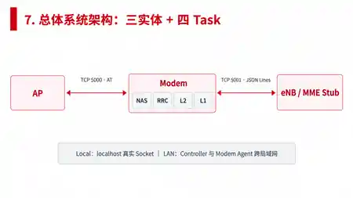
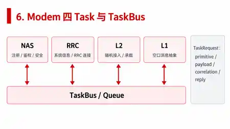
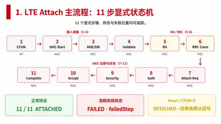
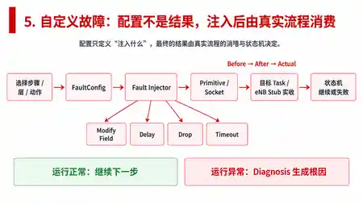
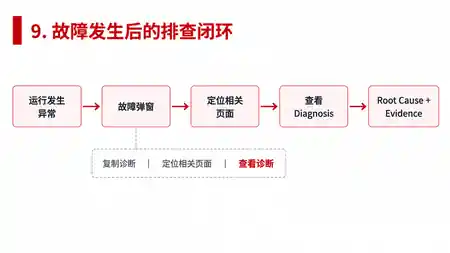
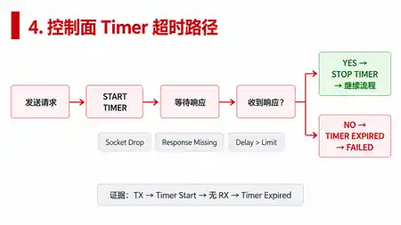
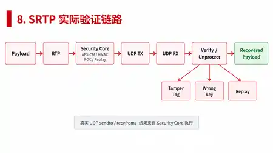

# LTE 控制面系统仿真平台 v6.1.2 详细技术文档

## 1. 文档目的

本文说明 v6.1.2 的架构、消息处理、诊断、Security、LAN 和发布方式。源码位置随各节列出。

系统模拟 AP、Modem、eNB/MME Stub 的交互，在 Modem 内部用 NAS/RRC/L2/L1 四个工作线程处理消息。11 步 Attach 的结果、收发记录和计时器状态可在页面中查看。

---

## 2. 模型与实现范围

### 2.1 当前实现覆盖

平台当前覆盖如下主线：

```text
AP AT 控制
  ↓
Modem 无线功能启用
  ↓
NAS Attach 启动
  ↓
MIB / SIB 获取与校验
  ↓
Random Access
  ↓
RRC Connection
  ↓
NAS Attach Request
  ↓
Authentication
  ↓
Security Mode
  ↓
Attach Accept
  ↓
Attach Complete
  ↓
ATTACHED
```

工程能力包括：

- AP-Modem、Modem-eNB/MME 两条真实 TCP 通道；
- NAS、RRC、L2、L1 四个 Worker 与 TaskBus/Queue；
- 11 步显式状态机；
- Procedure Timer 与工程保护 Timer；
- Primitive、Socket、Runtime Event、Log、Packet Trace；
- 预设故障与自定义 FaultConfig；
- 网络侧结构化 Decision Evidence；
- Evidence-driven Diagnosis；
- Local 与 LAN Controller/Modem Agent 双机模式；
- 独立 SRTP Security Core 与真实 UDP 验证；
- 浏览器 Web 与 Windows EXE 共用同一套前端；
- 本地 Run Repository、日志、导出与 fresh-extraction 发布验证。

### 2.2 未实现的功能

当前系统不是完整 LTE/EPC 产品，不实现：

- 真实 RF/PHY 空口和射频链路；
- 完整 ASN.1、S1AP、GTP、MME/SGW/PGW 商用协议栈；
- 多 UE 调度与大规模并发；
- TAU、Handover、Paging、Detach 全流程；
- 完整 IMS/VoLTE SIP/SDP/RTP 呼叫流程；
- 商用 3GPP 一致性认证。


---

## 3. 总体架构

### 3.1 三实体模型

系统把主要通信对象拆成三个逻辑实体：

1. **AP（Application Processor）**：负责 AT 命令入口、流程启动和状态查询；
2. **Modem**：包含 NAS/RRC/L2/L1 四个内部 Task，是控制面流程的核心执行体；
3. **eNB/MME Stub**：模拟网络侧响应、上下文与策略判断。

逻辑结构如下：

```text
Web / EXE
   │ HTTP + SSE
   ▼
SimulatorApplication / HTTP API
   │
   ▼
SimulatorEngine
   │
   ├──── TCP 5000 ─── AP ↔ Modem
   │
   └──── TCP 5001 ─── Modem ↔ eNB/MME Stub

Modem 内部：
NAS  ↕
RRC  ↕
L2   ↕   TaskBus / Queue / Primitive
L1   ↕
```

Local 模式下 TCP 连接使用 localhost，但仍通过 OS Socket；LAN 模式下 Modem Agent 位于第二台电脑，协议通道跨真实局域网。

### 3.2 后端状态

前端不维护独立 Attach 状态机。所有页面状态都来自后端 `StateStore`，主要执行链为：

```text
用户操作
  ↓
HTTP API / AT Parser
  ↓
SimulatorEngine
  ↓
Worker / TaskBus / Socket / Timer
  ↓
StateStore + Runtime Trace
  ↓
HTTP / SSE
  ↓
Web UI
```

Attach 的状态推进由引擎执行。

---

### 3.3 v6.0.3：有状态网络侧与证据链



Local 模式下 AP、Modem、eNB/MME Stub 仍通过真实 TCP Socket 连接，但 v6.0.3 的 eNB/MME 端不再仅对单条 JSON 做无状态 `if` 判断。`NetworkControlPlaneContext` 以 `transactionId` 为键维护 `cellState`、`randomAccessState`、`rrcState`、`authenticationXres/authenticationState`、`securityState` 与 `attachState`。例如 `NAS_AUTHENTICATION_RESPONSE` 必须建立在先前 `NAS_ATTACH_REQUEST` 已创建 `CHALLENGE_SENT + XRES` 的上下文上，`NAS_SECURITY_MODE_COMPLETE` 又要求 Authentication 已进入 `AUTHENTICATED`，最终 `NAS_ATTACH_COMPLETE` 要求 Security Context 为 `ACTIVE`。

跨 Socket 的每次观察都有独立 Event ID；Modem TX 与 eNB/MME Peer RX 对同一逻辑 payload 分别计算 SHA-256。两端对规范化后的消息对象计算摘要，用于核对消息内容。该摘要不覆盖原始 TCP 字节流。Packet Trace 只保存摘要、Hash 与必要元数据，长期记录以摘要和必要字段为主。




### 3.4 v6.0.4：并发与数据完整性加固

v6.0.4 不扩展 LTE 场景数量，重点处理审查中发现的工程边界。HTTP Run ZIP 导出改为每个请求独占临时目录，避免 ThreadingHTTPServer 并发请求共享 `.exports/run-export.zip`；LAN 将实时 Management Snapshot 与终态完整档案分离，按 transaction 分页拉取六类证据并校验总条数和 SHA-256，归档失败保持可重试。`NetworkControlPlaneContext` 的一次 Context→Rule→Decision→State→Message 操作现在在同一上下文锁内完成，避免线程化 TCP 服务中同一 transaction 被并发消息看到半更新状态。

StateStore 的 SSE 也合并了刷新请求：每条日志仍产生轻量 log event，但触发完整 `public_state()` 的刷新信号按约 50 ms 窗口合并并保留尾部更新，不再“一条日志复制并推一次整份状态”。这些修改不改变 LTE 消息顺序，只收紧并发、档案和可观测通道。

## 4. 11 步 Attach 状态机



`src/lte_sim/models.py` 定义用户可见的 11 个步骤。当前状态机主线如下：

| 步骤 | Key | 主要执行内容 | 关键观察点 |
| --- | --- | --- | --- |
| 1 | `cfun_enable` | AP 发送 `AT+CFUN=1` | AT History、Socket TX、Modem State |
| 2 | `nas_attach_req` | NAS 创建 Attach 事务 | NAS Task、T3410、transactionId |
| 3 | `mib_sib_read` | RRC/L1 获取系统信息 | READ_MIB_SIB、BCCH_DATA_IND |
| 4 | `system_info_validate` | 校验 MIB/SIB、Cell Barred、PLMN、TAC | RRC Decision、参数证据 |
| 5 | `random_access` | RA Preamble / Response | L2、Preamble、RA Decision |
| 6 | `rrc_connection` | RRC Request / Setup / Complete | T300/T301、Transaction ID |
| 7 | `nas_attach_request` | 发送 Attach Request | UE Context、Attach Type |
| 8 | `authentication` | Authentication Request/Response | RES/XRES、auth_result |
| 9 | `security_mode` | Security Mode Command/Complete | Integrity/Cipher Policy |
| 10 | `attach_accept` | 网络侧返回 Attach Accept | Bearer/GUTI 等简化上下文 |
| 11 | `attach_complete` | UE 回送 Attach Complete | UE Context、最终 ATTACHED |

每个流程由 `AttachContext` 记录 transactionId、cancel event、运行场景、相关 correlation ID 和步骤计时。中断、CFUN=0、系统重置都会先取消当前事务，旧线程在 checkpoint 处停止，防止“Reset 后旧线程继续回写”的并发问题。

---

## 5. TaskBus 与并发模型

### 5.1 四个 Task

Modem 内部把控制面职责拆分为：

- **NAS**：Attach、Authentication、Security、注册状态；
- **RRC**：系统信息、RRC Connection、RRC 事务；
- **L2**：随机接入、承载相关抽象；
- **L1**：空口消息和系统信息获取的简化物理层抽象。

Worker 通过 `TaskBus` 传递 `TaskRequest`/Primitive，记录 primitive、payload、correlation、reply、排队与处理状态。这样可以观察“某个协议步骤是谁发起、谁消费、是否真的到达目标 Task”。

### 5.2 Trace

Task / Trace 页面提供三档观察级别：

- **关键链路**：默认展示主要控制面事件；
- **诊断事件**：过滤到故障、Timer、网络侧 Decision 等；
- **全部原语**：用于深度排查 Worker 生命周期和完整消息序列。

Trace 显示后端产生的原语和运行事件。

---

## 6. Socket 与传输

### 6.1 AP-Modem

AP 通过 TCP 5000 向 Modem 发送 AT 指令和控制消息。AT Parser 负责识别 `AT+CFUN=1`、状态查询等指令，执行结果进入统一状态与日志。

### 6.2 Modem-eNB/MME Stub

Modem 与网络侧使用 TCP 5001，承载控制面 JSON Lines 消息。Stub 根据实际收到的字段执行策略检查，并返回相应结果。

### 6.3 Management

LAN 模式额外使用 Management 5002，用于 Controller 与 Modem Agent 的状态镜像、heartbeat、连接状态和管理操作。为避免运行证据持续膨胀导致 Management Frame 过大，跨机只同步有界、紧凑的运行摘要；完整 Evidence 仍保留在产生它的本机运行时。

---

## 7. Fault Injection



### 7.1 统一 FaultConfig

预设场景和自定义故障最终都转换为同一份 FaultConfig。主要动作包括：

- `MODIFY_FIELD`：修改 Primitive 或 Socket 消息真实字段；
- `DELAY` / `SOCKET_DELAY`：增加消息延迟；
- `DROP` / `SOCKET_DROP`：抑制交付；
- `DUPLICATE`：重复消息；
- `TIMER_TIMEOUT`：让等待链真实到期。

自定义字段并非任意内存修改，只允许使用后端 catalog 中存在且具有类型定义的字段。字符串、整数、布尔、对象分别执行类型校验。

### 7.2 预设场景不等于预设结果

v6.0.3 中，预设场景下拉框不再直接显示“第几步必然失败、改了哪个值”。用户选择场景后先运行流程，再通过 Trace / Diagnosis 定位实际影响。具体注入参数仍可在“查看注入参数”中查看，便于测试复现。

### 7.3 深层网络侧判定

当前已覆盖多类结构化控制面检查，例如：

- System Info：消息结构、MIB/SIB、Cell Barred、PLMN、TAC；
- RA：Preamble Index 合法性；
- RRC：establishment cause、transactionIdentifier；
- Attach Request：UE Context、Attach Type；
- Authentication：UE Context、auth_result、RES/XRES；
- Security：Integrity、Cipher；
- Attach Complete：活动 UE Context。

每次网络侧判定可以产生 `decisionLayer`、`policySource`、`decisionPoint`、`failedCheck`、`causeChain`、input/output message 等证据。

---

## 8. Evidence-driven Diagnosis



### 8.1 Blind Diagnosis（盲诊断）

普通失败报告本身已经不读取 Scenario 名称；v6.0.3 进一步提供 `/api/diagnostics/blind`。盲诊断重新执行时只传入本次 transaction 的 `runtimeEvents`，明确 `scenarioProvided=false`、`faultConfigProvided=false`，并过滤全部 `FAULT_INJECTED` 事件。诊断可使用的证据仅包括 Primitive 创建/消费、Socket TX/RX/Peer RX/Peer TX、Timer、State Transition、Network Decision 和 Validation/Worker Error。

报告新增 `diagnosisInput`、`diagnosticVerdict` 与 `runtimeReplay`。例如 Authentication 参数被改写后，盲诊断并不知道“选择了 AUTH_NETWORK_REJECT”，仍可从 Peer RX 的 `res`、MME 当前 XRES、`RES / XRES = FAIL` 和 `NAS_AUTHENTICATION_REJECT` 推导 `diagnosticVerdict=RES_MISMATCH`。


Diagnosis 的输入是运行事件。主要证据包括：

- Primitive Before / After；
- Consumer Actual；
- 协议期望值；
- Network Decision Checks；
- Timer Started / Stopped / Expired；
- Socket TX / RX / Drop / Timeout；
- State Transition；
- correlation ID / fault ID。

典型 RES/XRES 异常链如下：

```text
Authentication Response
  res = SIMULATED_RES
        ↓ Fault Injector
  res = INVALID_RES
        ↓ Socket
  eNB/MME Stub 实收 INVALID_RES
        ↓
  UE Context       PASS
  auth_result      PASS
  RES == XRES      FAIL
        ↓
  RES_MISMATCH
        ↓
  NAS_AUTHENTICATION_REJECT
        ↓
  Diagnosis Root Cause
```

v6.0.3 Diagnosis 首屏改为紧凑双栏：左侧集中显示根因摘要、控制面判定和 Before/After 快照，右侧显示事实卡与下一步建议；下方继续保留相关 Timer、关键 Evidence 和最近日志。

此外，Diagnosis 页提供**运行系统检查**，可在没有故障时主动检查状态机、Socket、TaskBus、Timer、Network Decision 和 Security 状态。它与“发生失败后的根因诊断”是两个不同入口。

---

## 9. Timer



系统区分两类计时器：

1. **协议过程 Timer**：用于模拟 LTE procedure timing，例如 T300、T301、T3410、T3411 等；
2. **工程保护 Timer（`G_*`）**：用于保证仿真线程、队列或网络等待不会无限挂起。

Timer Evidence 记录启动时间、上限、停止原因和过期事件。对于 Drop/Timeout 场景，Diagnosis 可以确认“请求是否已经发出、对应 RX 是否缺失、哪个 Timer 最终到期”。

---

## 10. Security



### 10.1 SRTP、SRTCP 与 NAS

媒体模块处理 SRTP/SRTCP，NAS 模块处理 Attach 中的受保护消息。各模块分别维护计数器、认证结果和重放状态。

### 10.2 SRTP 收发与状态处理

`core.py` 继续维护 AES-128-CM/HMAC-SHA1-80、kdr=0 的 RTP/SRTP protocol state：RFC 3711 KDF、Packet Index、Sequence/ROC、128-packet Replay Window、IV/authentication input 和 protect/unprotect。v6.1.1 使用锁实现 `SecurityContext` 的 sequence allocation + protect + counter update 原子化，并在 Core replay commit 之前完成外层 metadata / wire bytes 校验。UDP Lab 根据逐包字节、恢复内容和预期错误码汇总结果。

可选 `pylibsrtp` 对照扩大到 single packet、RTP header variant、multi-SSRC、rollover、SRTCP Receiver Report、SRTCP Compound 六组（其中 SRTCP 两组是否可运行取决于当前 pylibsrtp binding 是否暴露 RTCP API）；运行时仍不依赖 libSRTP。

### 10.3 SRTCP

新增 `srtcp.py`，维护独立 31-bit SRTCP index、E-bit、AES-128-CM、HMAC-SHA1-80、Replay Window 和多 SSRC 状态。RTCP/SRTCP 与 RTP/SRTP 共享会话密钥生命周期，但 packet state 独立；支持基础 SR/RR 和 Compound RTCP 结构验证。authentication/replay 失败不会提交接收状态。

### 10.4 Re-key / Session Lifecycle

`session.py` 区分 re-key 与 restart：re-key 更换 fresh master key+salt 并保留 SRTP ROC/replay 与 SRTCP index/replay；restart 重建 packet state，因此默认禁止使用当前或历史已经使用过的 master key+salt，以避免 index 重置后产生 keystream reuse 风险。生命周期公开 generation、rekeyCount、restartCount 和 key fingerprint，不公开 key bytes。

### 10.5 NAS Security Mode → 实际 PDU bytes

`nas_security.py` 根据 EIA2/EEA2 协商结果维护 32-bit NAS COUNT 与实际字节处理。COUNT 使用 24-bit overflow + 8-bit sequence，并为 UL/DL 分别维护发送与接收状态。

主链路为：

```text
Authentication PASS
  → 建立 transaction NAS Security Context
  → Security Mode Command：EIA2 integrity，未 cipher；DL COUNT
  → Security Mode Complete：EEA2 + EIA2；UL COUNT
  → Attach Accept：EEA2 + EIA2；DL COUNT
  → Attach Complete：EEA2 + EIA2；UL COUNT
```

Runtime Evidence 记录 `NAS_SECURITY_PDU_PROTECTED / VERIFIED / FAILED`，包括 direction、COUNT、sequence、ciphered、MAC 和 plain/protected SHA-256。接收端只有在 EIA2、Replay、解密和消息类型检查全部通过后才提交 RX 状态。

EEA2 使用 AES-128-CTR，EIA2 使用 AES-CMAC-32，测试包括 EIA2 已知答案用例。NAS 密钥按事务模拟派生，内层字段采用项目简化编码；完整 EPS AKA/KASME KDF 和 TS 24.301 解码尚未实现。

### 10.6 测试与外部复用

`run_standalone_core_checks()` 当前包含 17 项 Core 检查，覆盖 SRTP/SRTCP/re-key/NAS bytes；既有 RFC 向量和新增 3GPP EIA2 known-answer 分开核对。`StandaloneSrtpModule` 仍是其他 Python 项目最小的媒体安全复用入口，只接受 raw RTP/RTCP bytes；`service.py` 与 `udp_lab.py` 属于平台适配/实验层。

v6.1.1 暂不实现 AES-GCM profile、MKI、DTLS-SRTP、完整外部密钥协商、完整 EPS AKA/KASME KDF 或完整 TS 24.301 codec。AES-GCM 若后续实现，应按独立 AEAD SRTP profile 处理 IV/AAD/Tag/SRTP/SRTCP，不能只替换 cipher。

---

## 11. Local / LAN 模式

### 11.1 Local

AP、Modem、eNB/MME Stub、Web、Security 均在单机运行，协议通道仍使用真实 loopback TCP/UDP。适合开发、单机演示和功能验证。

### 11.2 LAN

电脑 A 运行 Controller/Web，电脑 B 运行 Modem Agent。典型启动顺序：

1. 两机处于同一局域网；
2. 电脑 B 启动 Modem Agent；
3. 主控填写 Modem IP、Controller IP、端口与 token；
4. 执行连接测试；
5. 确认 Agent、Management、AP-Modem、Modem-eNB 状态；
6. 进入 LAN 模式执行 Attach。

LAN READY 由实际连接探测产生，而不是只显示固定状态。

---

## 12. Web / Windows EXE

当前只保留 Web 和 Windows EXE 两种用户入口。Windows EXE 内部仍启动同一套 HTTP API 与 Web 前端，并通过 WebView2 显示，因此不存在两套业务 UI 长期漂移的问题。

启动器在进入主页面前选择 Local/LAN；设置页可调整显示比例、退出当前模式、查看并打开本地 `runs` 目录。Windows 本机导出支持原生“另存为”路径选择；程序自己的日志和 Run 仍保留在原数据目录。

---

## 13. 本地数据与导出

Windows EXE 默认使用用户可写目录保存：

```text
%LOCALAPPDATA%/LTEControlPlaneSimulator/
├─ var/
├─ runs/
├─ logs/
└─ webview/
```

`runs/` 保存运行归档；日志和状态文件不写进源码目录。导出 Logs、Trace、Diagnosis、Run ZIP 或 PCAP 时，Windows 本地主控可以弹出原生保存对话框选择副本路径。

---

## 14. 测试与发布质量

v6.1.2 的完整本地验收记录为 **432 / 432 PASS**，源码专用 `source_self_test.py` 为 **163 / 163 PASS**，并覆盖 wheel 构建、隔离安装及项目目录外场景加载。GitHub Actions 进一步分为 Ubuntu/Python 3.13 全量源码验证、Ubuntu/Python 3.10 兼容性验证和 Windows/Python 3.13 兼容性验证。`devtools/validation/self_test.py` 额外执行：

- Python compileall；
- HTML/JavaScript ID 一致性；
- 五工作区结构检查；
- Web/Windows EXE 前端契约；
- JavaScript syntax；
- 19 条前端/API 路由契约；
- 现行文档契约；
- 全量 Unit / Feature / E2E / UI 测试。

源码 ZIP 由 `scripts/build/package-source.py` 生成，ZIP 内生成 `packaging/SOURCE-MANIFEST.json`。发布前可从全新目录使用**包内代码**重新执行 self-test，并检查 Manifest 文件集合与逐文件 SHA-256、ZIP CRC、中文文件名、路径安全和 Clean Source，避免“工作目录能跑、发布包缺文件”的问题。

---

## 15. 源码目录

```text
src/lte_sim/
├─ control_plane/       # Attach Engine、规范与运行逻辑
├─ fault_injection/     # FaultConfig / FaultInjector / catalog
├─ diagnostics/         # Runtime Evidence → Root Cause
├─ runtime/             # TaskBus、Timer、Trace、Clock
├─ security_engine/     # SRTP Core、vectors、UDP Lab
├─ web/                 # Web/EXE 共用前端
├─ http_api.py          # HTTP/SSE/API、导出、runs
├─ lan.py               # Controller/Agent 与 Management
├─ modem_agent.py       # 第二台电脑 Agent
├─ embedded_app.py      # Windows EXE WebView2 入口
├─ startup_ui.py        # Local/LAN 启动器
├─ state.py             # StateStore
└─ network.py           # Socket / Stub 通信
```

构建、验证和开发辅助脚本位于 `scripts/` 与 `devtools/`。根目录不放零散 `.ps1/.cmd/.py` 启动脚本。

---

## 16. Windows 构建

Windows 10/11 x64 上正式构建入口：

```powershell
.\scripts\windows\build-exe.ps1 -Bootstrap
```

环境准备好后可直接：

```powershell
.\scripts\windows\build-exe.ps1
```

构建脚本使用 `packaging/app-icon.ico` 作为 EXE 图标；该图标由 `packaging/app-icon-source.png` 通过 `scripts/build/create-app-icon.py` 生成。v6.0.3 会先清除原图近黑背景、裁切主体，再生成透明 PNG/ICO。

---

## 17. 后续可扩展方向

若继续开发，优先级建议为：

1. 在现有 Decision Evidence 上增加更多 LTE 过程，而不是先增加更多页面；
2. 增加更完整的网络侧上下文状态和错误码映射；
3. 对 Security 增加更多标准向量、RTP 边界和参考实现差分覆盖；
4. 在 Windows 双机环境持续做 LAN 回归；
5. 继续优化 UI 信息密度，但不让前端承担协议判断；
6. 若后续增加 TAU/Handover/多 UE，应先扩展状态模型和消息规范，再扩展 UI。

维护时由后端更新运行状态，页面负责显示；诊断应列出使用的 Primitive、Socket、Timer、网络侧判定或状态变化。
